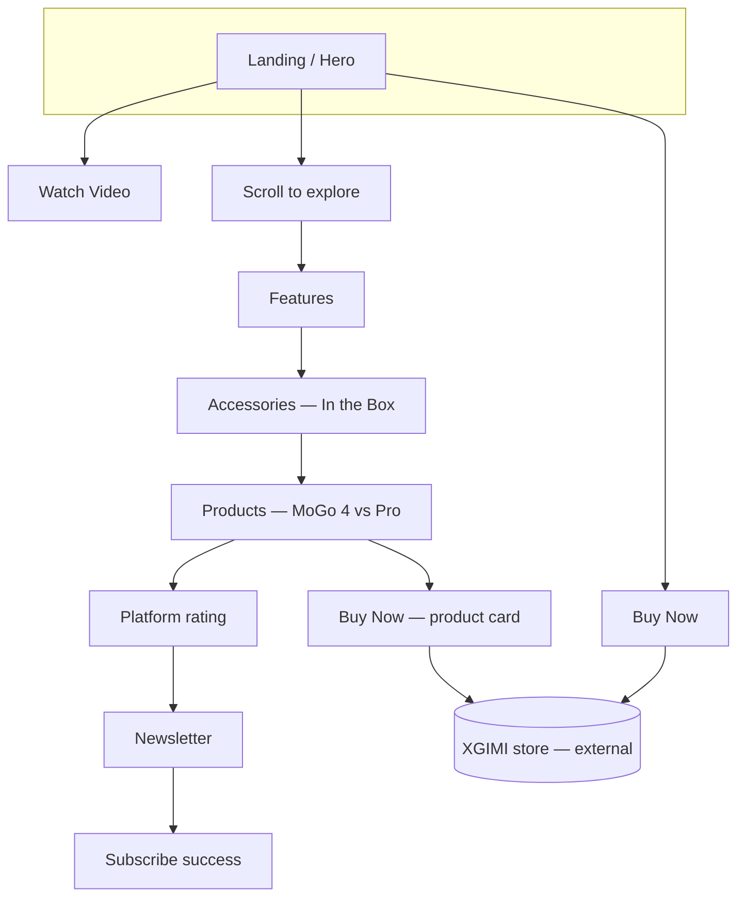
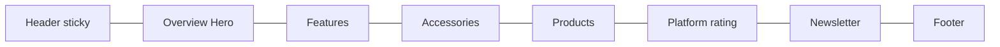
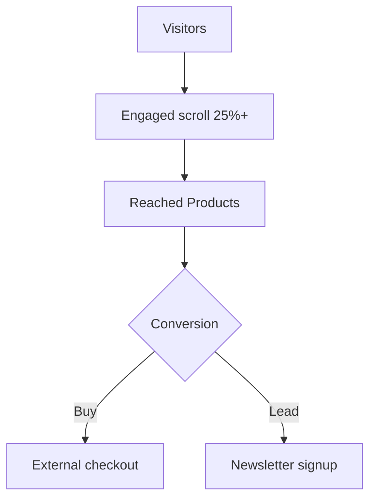
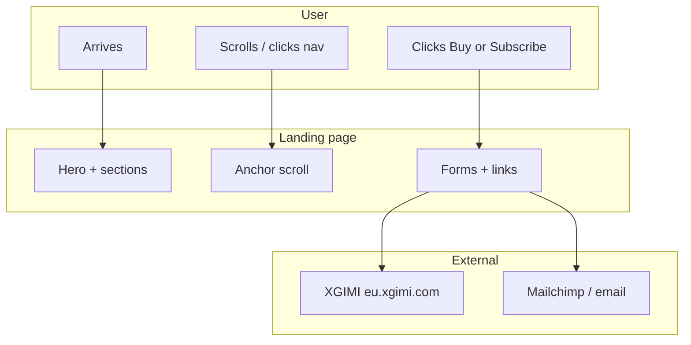

# Figma High-Fidelity Wireframe Spec: MoGo 4 Landing Page

Complete reference: **user flows**, **Mermaid diagrams** (embed in Notion/GitHub), **detailed layout notes**, **presentation flow**, and **how to build this correctly in Figma**.

---

## Table of contents

1. [Simple visual flow (presentations)](#1-simple-visual-flow-presentations)
2. [Mermaid diagrams (embedding)](#2-mermaid-diagrams-embedding)
3. [ASCII flow (legacy)](#3-ascii-flow-legacy)
4. [Detailed layout notes by section](#4-detailed-layout-notes-by-section)
5. [How to design these wireframes in Figma](#5-how-to-design-these-wireframes-in-figma)
6. [Design tokens (match live site)](#6-design-tokens-match-live-site)
7. [Figma file structure & prototyping](#7-figma-file-structure--prototyping)

---

## 1. Simple visual flow (presentations)

Use this slide-friendly version: **one path, minimal text**.

```
┌─────────┐     ┌─────────────┐     ┌─────────────┐     ┌─────────────┐
│  LAND   │ ──▶ │   EXPLORE   │ ──▶ │   DECIDE    │ ──▶ │  CONVERT    │
│  Hero   │     │  Scroll     │     │  Products   │     │  Buy / Lead │
└─────────┘     └─────────────┘     └─────────────┘     └─────────────┘
     │                 │                    │                   │
     │                 │                    │                   └── XGIMI store
     │                 │                    │                       or newsletter
     │                 │                    └── Compare MoGo 4 vs Pro
     │                 └── Features → In the Box → Products
     └── Buy now OR watch video OR scroll
```

**3 bullets for slides**

- **Land:** Hero + header; first impression and primary CTAs.  
- **Explore:** Single scroll through Features → Accessories → Products → ratings → Newsletter.  
- **Convert:** Buy Now (hero / header / product cards) or Newsletter signup.

**Optional fourth slide — “Shortcuts”**

- Header **Buy Now** anytime · Hero **Buy Now** · Product cards **Buy Now** · **Watch Video** (engagement).

---

## 2. Mermaid diagrams (embedding)

**Copy-paste source:** [`user-flow.mmd`](./user-flow.mmd) — same four diagrams, with a short “where to paste” note at the top.

Paste into **Notion** (Mermaid block), **GitHub** `README.md`, **Obsidian**, or export from Mermaid Live Editor as SVG/PNG for slides.

### 2.1 Primary user flow (decision tree)



### 2.2 Linear scroll journey (same page)



### 2.3 Conversion funnel (simplified)



### 2.4 Swimlane (who / what)



---

## 3. ASCII flow (legacy)

```
                                    ┌──────────────┐
                                    │   LANDING    │
                                    │  (Hero View) │
                                    └──────┬───────┘
                                           │
                    ┌──────────────────────┼──────────────────────┐
                    ▼                      ▼                      ▼
             ┌─────────────┐        ┌─────────────┐        ┌─────────────┐
             │  BUY NOW    │        │ WATCH VIDEO │        │   SCROLL    │
             └──────┬──────┘        └─────────────┘        └──────┬──────┘
                    │                                              │
                    │         FEATURES → ACCESSORIES → PRODUCTS → NEWSLETTER
                    │                                              │
                    └──────────────────────┬─────────────────────┘
                                           ▼
                                    ┌────────────────┐
                                    │ XGIMI STORE    │
                                    └────────────────┘
```

---

## 4. Detailed layout notes by section

Use **Desktop frame: 1440 × 900** (or **1440 × 1024** for taller hero). **Content width** matches code: `max-width 1400px`, horizontal padding **32px** (2rem) desktop / **24px** (1.5rem) mobile.

### 4.1 Global — Header (all sections)

| Property | Spec |
|----------|------|
| Position | Fixed top, full width, z above content |
| Height | ~72–80px (include safe area if simulating mobile) |
| Inner layout | Auto-layout horizontal · **space between** |
| Left cluster | Logo wordmark “XGIMI” |
| Center | Nav links: Overview · Features · Products · In the Box · Support (hide on mobile; hamburger + overlay) |
| Right cluster | Cart icon (24px tap) · **Buy Now** button · hamburger (mobile only) |
| Scrolled state | Optional “glass”: `rgba(20,20,23,0.6)` + blur 12px + 1px border `rgba(255,255,255,0.08)` |
| Buy Now | Primary/accent style; min height **~44px** for touch |

**Figma:** Header as **component** with variant `Default` / `Scrolled` (opacity/blur).

---

### 4.2 Hero (`#overview`)

| Property | Spec |
|----------|------|
| Min height | **100vh** (frame height ≥ 900 for desktop wireframe) |
| Top padding | **80px** below header so text clears fixed nav |
| Background | Full-bleed image layer(s); carousel = 7 slides, crossfade |
| Overlay | Linear gradient L→R: dark `rgba(10,10,12,0.95)` → `0.8` @ 40% → `0.2` @ 100% |
| Content column | Left-aligned inside container; text block **max-width ~650px** |
| Vertical align | Flex **center** (content vertically centered in viewport) |

**Stack order (top → bottom) — use Auto-layout vertical, gap as noted:**

| Block | Notes |
|-------|--------|
| Badge | Pill: uppercase, ~`0.85rem`, padding ~6–16px, radius 100px, pink/red tint border |
| H1 | Two lines: “XGIMI MoGo 4” + gradient line “Limitless Play.” — Manrope extrabold, ~48–88px desktop |
| Subtitle | ~20px, secondary white 65%, max-width ~500px, margin top ~24px, bottom ~40px |
| Feature stats row | Horizontal Auto-layout, **gap 48px**, **top border** 1px subtle, **padding-top 32px** |
| Each stat | Big number (e.g. 550, 1080p, 5H) + small label below |
| CTA row | Horizontal, **gap ~16–24px**; Primary “Buy Now - $499” · Outline “Watch Video” |
| Rating | Stars row + “4.9/5” + “Join 1.2M+…” secondary text |

**Wireframe fidelity:** Use placeholder rectangles for hero image; keep **real copy** for hi-fi.

---

### 4.3 Features (`#features`)

| Property | Spec |
|----------|------|
| Section padding | **128px** top & bottom (`8rem`) |
| Section header | Centered, **max-width 600px**, margin bottom **80px** |
| H2 + subtitle | H2 + 1rem margin top on subtitle, ~19px subtitle |

**Grid — feature cards (4-up):**

| Property | Spec |
|----------|------|
| Grid | `repeat(auto-fit, minmax(280px, 1fr))` → at 1440px ≈ **4 columns** or 2×2 if narrow |
| Gap | **32px** |
| Card | Radius **12px**, min height ~320–400px (content + image) |
| Card structure | (1) Full-bleed bg image z0 opacity ~0.6 (2) Gradient overlay bottom-heavy (3) Content padding **48px 32px**: icon box → H3 → body |
| Icon container | ~48px icon in padded rounded rect, accent border |

**“See the MoGo 4 in Action” block:**

| Property | Spec |
|----------|------|
| Spacing | **64px** margin top, **96px** margin bottom above next block |
| Media | Large 16:9-ish container; **6** slides as image stack or carousel |
| Controls | Dot indicators bottom-center |

**Showcase slideshow (5 slides):**

| Property | Spec |
|----------|------|
| Layout | Each slide: **2 columns** — text (H2 + paragraph) \| image (~50/50 or 45/55) |
| Alternate | Odd slides: text left / image right · Even: **reverse** (text right / image left) |
| Controls | Row of dots below slideshow |
| Optional CTA | Slide index 3 (“Built-in Favorites”): **Learn More** outline button below copy |

---

### 4.4 Accessories — In the Box (`#accessories`)

| Property | Spec |
|----------|------|
| Section padding | **128px** vertical (match `.section`) |
| Main grid | **2 columns** `1.2fr : 1fr`, **gap 48px** |
| Left column | Single large showcase **height ~600px**, radius **24px**, image + **bottom gradient overlay** + title + paragraph |
| Right column | Vertical stack **gap 32px**: (1) Glass **details card** padding **48px**, H3 “In the Box”, intro paragraph, **list** ~24px row gap (2) Smaller image card **radius 24px** |

**List items:** Each row: primary line (item name) + secondary line (short description).

**Mobile wireframe:** Stack — showcase full width, then card, then small image.

---

### 4.5 Products (`#products`)

| Property | Spec |
|----------|------|
| Grid | `minmax(350px, 1fr)` × 2 columns at desktop, **gap 48px** |
| Card | Radius **24px**, column flex; image area **fixed height ~300px**, `object-fit: cover` |
| Pro card | **1px** accent border; **badge** top-right “Pro Excellence” pill (absolute pos ~24px from edges) |
| Body padding | **40px** all sides |
| H3 | ~32px title |
| List | Feature bullets with spacing |
| Footer row | Price (prominent) + **Buy Now** button (MoGo 4: outline; Pro: accent) |

---

### 4.6 Newsletter

| Property | Spec |
|----------|------|
| Container | Centered “glass” card: max-width ~900–1000px, padding **48–64px**, radius **24px** |
| Layout desktop | **2 columns**: left = H2 + description · right = form + privacy note |
| Form | Email field + **Subscribe** button — horizontal Auto-layout or stacked on mobile |
| Success state | Replace form with check + “Thanks for subscribing!…” |
| Privacy line | Small muted text + link |

---

### 4.7 Mobile (375 × 812) adjustments

| Area | Rule |
|------|------|
| Container | Padding **24px** horizontal |
| Header | Logo + cart + hamburger; **Buy Now** optional in bar or inside menu |
| Hero | Stack stats **2×2** or horizontal scroll pills; CTAs **full width** stack |
| Features | Cards **1 column**; action carousel full width |
| Accessories | **1 column** stack |
| Products | **1 column**; cards full width |
| Touch | Min **44×44px** for icons and buttons |

---

## 5. How to design these wireframes in Figma

Follow this order so files stay organized and prototypes work.

### 5.1 File setup

1. **Create one Figma file:** e.g. `MoGo4 — Landing + Flows`.
2. **Pages (recommended):**
   - `00 — Cover & flow` (presentation flow + Mermaid export if pasted as image)
   - `01 — Wireframes` (low/detail gray boxes + real structure)
   - `02 — Hi-fi` (final visual, matches tokens below)
   - `03 — Components` (buttons, cards, header)
   - `04 — Prototype` (duplicate hi-fi frames for linked demo)

### 5.2 Frames & layout grid

1. **Desktop:** Frame **1440 × 900** (duplicate taller **1440 × 5600** for full scroll if you want one long artboard).
2. **Mobile:** **375 × 812**.
3. **Layout grid on desktop:** 12 columns, **margin 32**, **gutter 24** (adjust to taste; align to `max-width 1400` content).
4. **Layout grid on mobile:** 4 columns, margin 24.

### 5.3 Wireframe vs high-fidelity

| Stage | What to draw |
|-------|----------------|
| **Low-fi** | Gray blocks, real **information hierarchy** (H1/H2), **real copy**, placeholder images as mid-gray rectangles |
| **Mid-fi** | Real spacing from §4, Auto-layout on sections, correct **number** of cards/slides |
| **Hi-fi** | Product photos, glass effects (semi-transparent fills), gradients, **Manrope + Instrument Sans**, orange accent `#ff5722` |

**High-fidelity wireframes** in product teams usually means **mid-fi + real typography and color**, not final marketing retouching.

### 5.4 Auto-layout (critical)

- **Header:** Horizontal Auto-layout, space-between, fill width, fixed height ~72–80px.
- **Hero content:** Vertical Auto-layout, fixed width ~650px for text column.
- **Feature cards:** Vertical Auto-layout inside each card; card set to **fill container** in grid.
- **Product cards:** Vertical — image (fixed height 300) → body (fill).
- **Newsletter:** Horizontal Auto-layout (desktop); switch to vertical for mobile **variant**.

### 5.5 Components & variants

Create **components** early:

| Component | Variants |
|-----------|----------|
| `Button / Primary` | Default, Hover (optional) |
| `Button / Outline` | Default |
| `Nav link` | Default, Active |
| `Header` | Default, Scrolled, Mobile-open |
| `Product card` | MoGo 4, MoGo 4 Pro (badge + border) |
| `Feature card` | (optional) 4 instances with different icons |
| `Section header` | H2 + subtitle block |

Use **slot** or nested instances for card images.

### 5.6 Styles (local)

- **Colors:** `Bg/Primary` `#0a0a0c`, `Bg/Secondary` `#141417`, `Accent` `#ff5722`, `Text/Primary` `#ffffff`, `Text/Secondary` 65% white, `Border` `rgba(255,255,255,0.08)`.
- **Text:** `H1`, `H2`, `H3`, `Body`, `Caption` (map to Manrope / Instrument Sans sizes from §4).
- **Effects:** `Glass` = fill `rgba(20,20,23,0.6)` + background blur **12** (approximate CSS `backdrop-filter`).

### 5.7 Naming & layers

- Frames: `Desktop / Hero`, `Desktop / Features`, …
- Groups: `Header`, `Hero / Content`, `Hero / Background`
- Consistent names speed up **Prototype** connections and dev handoff.

### 5.8 Prototype mode

- **On canvas:** Duplicate frames as **scrollable parent** OR separate frames per section and connect with **After delay 0ms** + **Smart animate** for fake scroll (optional).
- **Links:** `Buy Now` → open URL (prototype external link) or placeholder “External: XGIMI”.
- **Nav:** Each anchor → corresponding frame (instant transition).
- **Newsletter:** Frame A (form) → Frame B (success) on button tap.

### 5.9 Handoff checklist

- [ ] All conversion CTAs labeled in **comments** (hero, header, products).
- [ ] Spacing matches §4 within ~8px.
- [ ] Mobile variants exist for Hero, Features grid, Products, Newsletter.
- [ ] Color styles applied (no one-off hex in random layers).
- [ ] Export flow diagram (SVG from Mermaid) on cover page for stakeholders.

---

## 6. Design tokens (match live site)

| Token | Value |
|-------|--------|
| `--bg-primary` | `#0a0a0c` |
| `--bg-secondary` | `#141417` |
| `--accent-primary` | `#ff5722` |
| Accent gradient | `135deg` · `#ff5722` → `#ff8a65` |
| Glass fill | `rgba(20, 20, 23, 0.6)` + blur |
| Border light | `rgba(255, 255, 255, 0.08)` |
| Font display | **Manrope** (headings) |
| Font UI | **Instrument Sans** (body) |
| Section vertical padding | **128px** (`8rem`) |
| Container max-width | **1400px** |
| Button radius | **8px** |
| Card radius (feature) | **12px** |
| Card radius (product/accessory) | **24px** |

---

## 7. Figma file structure & prototyping

### Suggested frame list

```
MoGo4-Wireframes/
├── 00-Cover-Flow-Simple
├── 01-Hero-Desktop
├── 02-Hero-Mobile
├── 03-Features-Desktop
├── 04-Features-Mobile
├── 05-Accessories-Desktop
├── 06-Accessories-Mobile
├── 07-Products-Desktop
├── 08-Products-Mobile
├── 09-Newsletter-Desktop
├── 10-Newsletter-Mobile
├── 11-Newsletter-Success
├── 12-Header-Scrolled
├── 13-Mobile-Menu-Open
└── 14-UserFlow-Mermaid-(SVG)
```

### User flow annotations (comments)

| Frame | Note |
|-------|------|
| Hero | Entry; 3 paths: Buy / Video / Scroll |
| Header | Persistent Buy Now |
| Features | Scroll depth KPI |
| Products | Compare → Buy |
| Newsletter | Lead conversion |

### Prototype connections

| From | To | Trigger |
|------|-----|---------|
| Buy Now (any) | External URL | Click |
| Nav links | Section frame | Click |
| Watch Video | Action section / overlay | Click |
| Newsletter Submit | Success frame | Click |
| Mobile menu | Menu open variant | Click |

---

## Key conversion points

1. **Hero Buy Now** — First impression.  
2. **Header Buy Now** — Always available.  
3. **Products Buy Now** — Post-comparison.  
4. **Newsletter** — Lead capture.

---

*Generated from `mogo4-landing-page` (App.jsx, components, CSS). Mermaid renders on GitHub/Notion; for Google Slides, export SVG from [mermaid.live](https://mermaid.live).*
